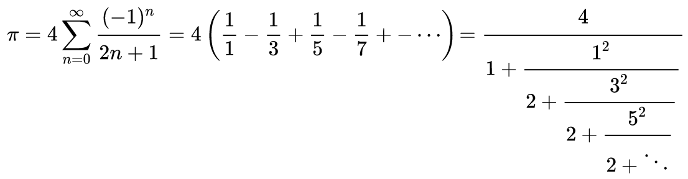

# Assignment #1B

The value of π can be approximated by using the Gregory-Leibniz series:

Write a C++ program to approximate π.

It should accept from stdin a single integer value of `n` and output to stdout the value of π with a precision of 10 decimal points.